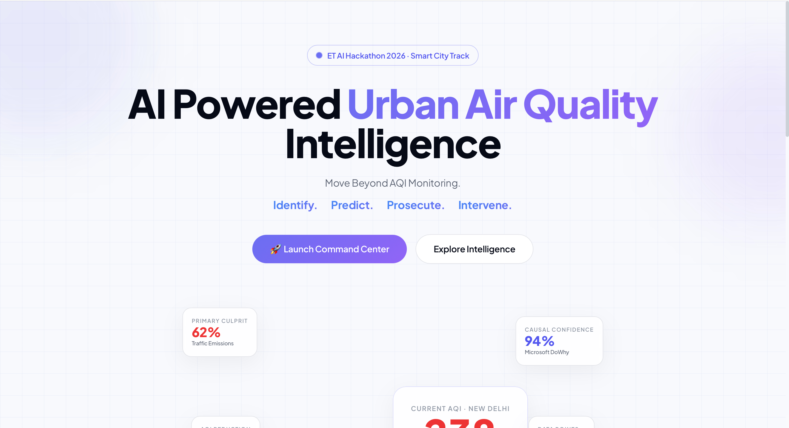
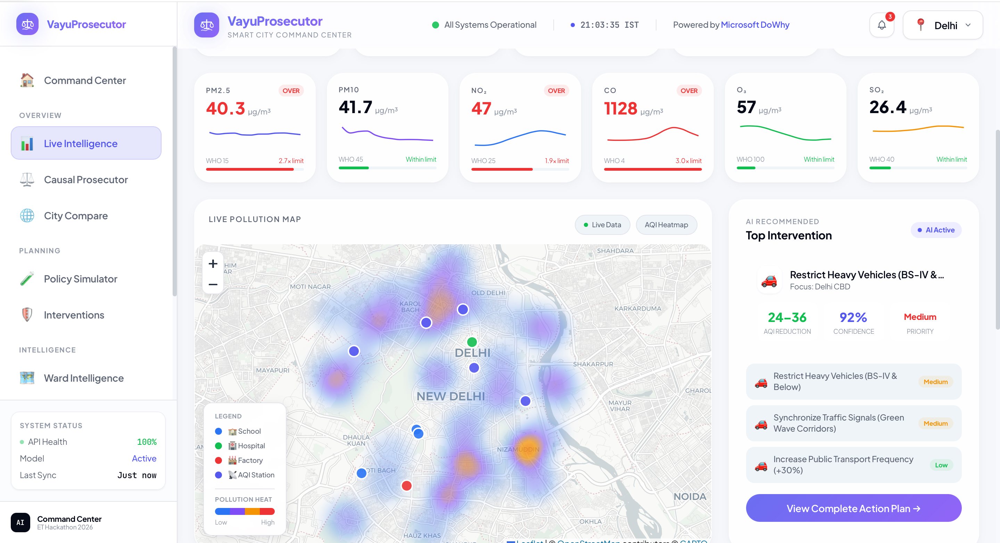
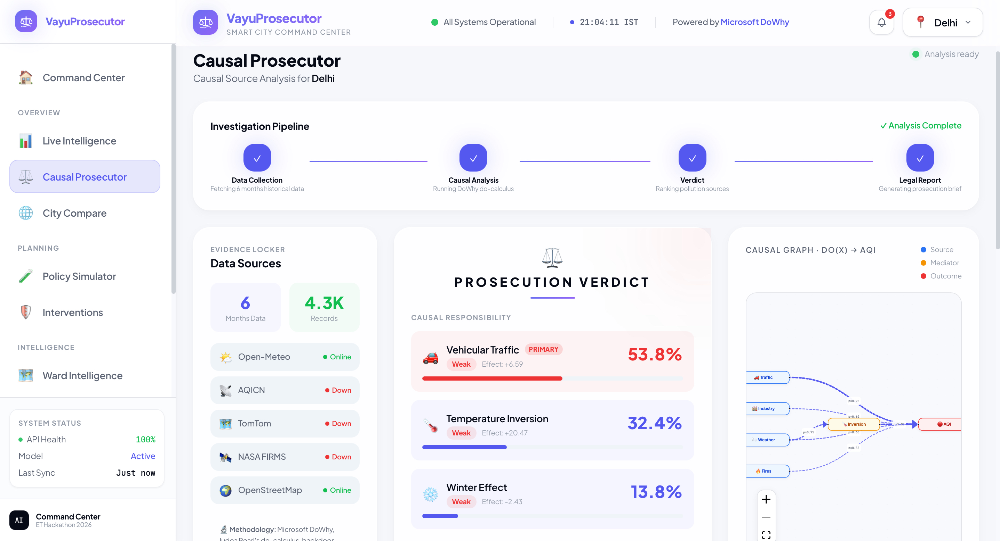
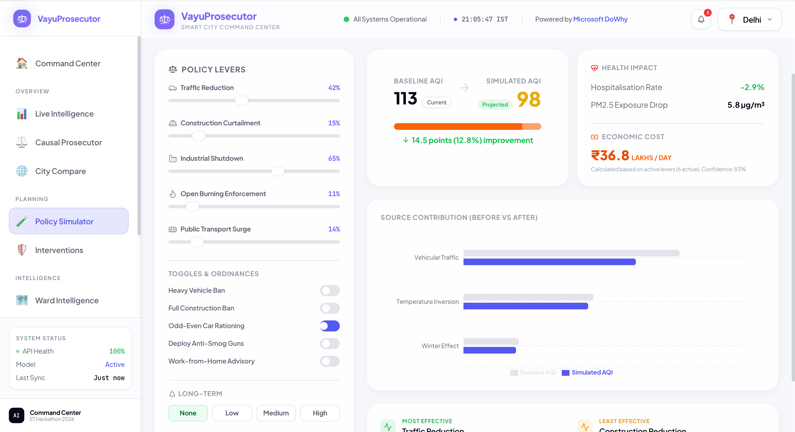
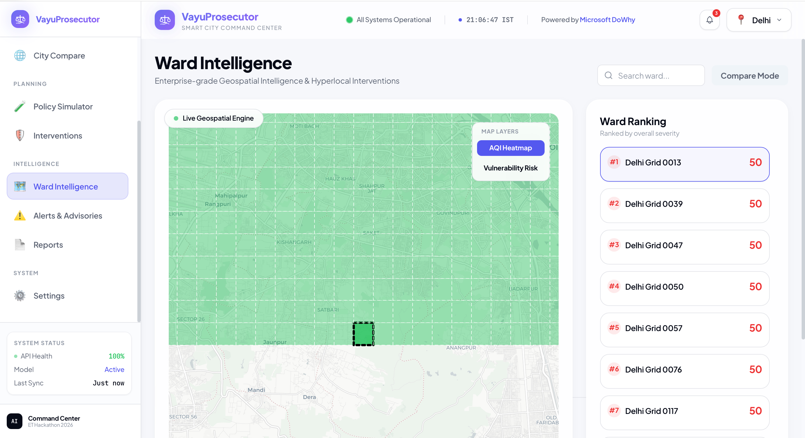
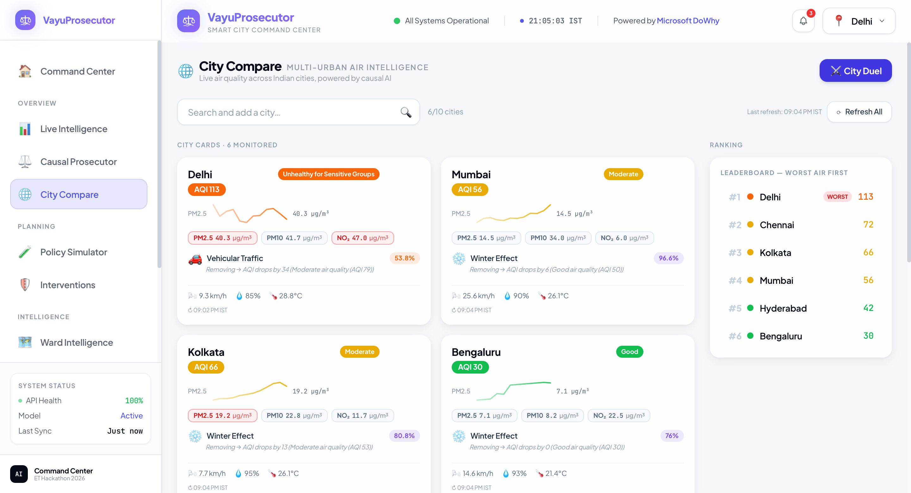
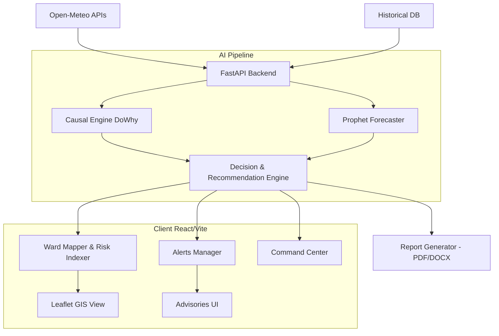

<div align="center">
  <h1>🌬️ VayuProsecutor</h1>
  <p><strong>AI-Powered Smart City Command Center for Environmental Prosecution</strong></p>
  <p><em>Hackathon Track: ET AI Hackathon - Smart Cities & Environmental Sustainability</em></p>

  [](https://reactjs.org/)
  [](https://www.typescriptlang.org/)
  [](https://fastapi.tiangolo.com/)
  [](https://www.python.org/)
  [](https://opensource.org/licenses/MIT)

</div>

---

## 🌍 Problem Statement
Urban air quality management is currently reactive. City administrators rely on basic dashboards that show **what** the AQI is, but fail to explain **why** it is happening, **where** the precise risks lie, or **how** to fix it. Without actionable intelligence, governments struggle to enforce environmental policies or prosecute polluters effectively.

## 💡 The Solution
**VayuProsecutor** is not just another AQI dashboard—it is a proactive **Environmental Command Center**. It transforms raw meteorological and pollutant data into actionable intelligence through a five-step engine:

- 🔮 **Predict**: Hyper-local ward-level AQI forecasting.
- 🔎 **Identify**: Causal AI DAGs attribute exact pollution percentages to specific sources (Vehicular, Industrial, Weather).
- ⚖️ **Prosecute**: Generates legally sound environmental reports and identifies primary offenders.
- 🚧 **Intervene**: Recommends immediate, actionable city-level interventions based on threshold breaches.
- 📊 **Report**: Enterprise-grade automated PDF/DOCX generation for government stakeholders.

---

## ✨ Key Features

### 📡 Live Intelligence
- Real-time aggregation of AQI, PM2.5, PM10, temperature, and wind speed.
- Dynamic GIS Heatmaps powered by Leaflet.

### 🧠 Causal Prosecutor
- DAG (Directed Acyclic Graph) visualizations mapping the causal impact of vehicular traffic, temperature inversions, and industrial emissions on the current AQI.
- DoWhy-powered causal inference engine for source attribution.

### 🏙️ Ward Intelligence
- Micro-level tracking of city wards.
- Automated Risk Indexing (1-100) identifying the most vulnerable neighborhoods.

### 🎛️ Policy Simulator
- Interactive scenario testing: Adjust EV adoption rates, industrial output, and construction bans to see simulated AQI improvements and economic impacts in real-time.

### 🚨 Alerts & Advisories
- Severity-based real-time alert feed (Critical, High, Moderate).
- Comprehensive acknowledgment workflows and historical timelines for emergency responders.

### 📑 Environmental Reports
- Automated reporting engine compiling executive summaries, ward intel, and causal analysis.
- 1-click export to **native PDF**, **DOCX**, and **CSV**.

### 🛠️ Interventions
- AI-recommended mitigation strategies tailored to the primary pollution source.
- Implementation tracking and status monitoring.

### ⚙️ Command Settings
- Granular administrative controls.
- API and Data Source management.
- Complete system health and audit log monitoring.

---

## 📸 Screenshots

| Landing Page | Command Dashboard |
|:---:|:---:|
|  |  |

| Causal Prosecutor | Policy Simulator |
|:---:|:---:|
|  |  |

| Ward Intelligence | City Compare |
|:---:|:---:|
|  |  |

---

## 🏗️ Architecture



---

## 💻 Technology Stack

| Category | Technology |
|---|---|
| **Frontend** | React 18, TypeScript, Vite, TailwindCSS |
| **Backend** | Python 3.13, FastAPI, Uvicorn |
| **AI / ML** | DoWhy (Causal), Prophet (Forecasting), Scikit-Learn |
| **GIS / Mapping** | Leaflet, React-Leaflet, Geopandas, Shapely |
| **Data Viz** | Recharts, React Flow (DAGs), Framer Motion |
| **Exports** | fpdf2, python-docx |

---

## 📂 Project Structure

```text
.
├── api_server.py                 # Main FastAPI Application
├── data/                         # Local JSON Database (Mock persistence)
├── frontend/                     # React + Vite Client
│   ├── package.json              # Frontend Dependencies
│   └── src/
│       ├── components/           # Reusable UI & GIS Components (Maps, Charts)
│       ├── lib/                  # API Hooks (React Query), Types, Mocks
│       └── pages/                # Core Modules (Alerts, Causal, Reports, etc.)
├── requirements.txt              # Python Dependencies
└── src/                          # Backend AI Modules
    ├── causal_engine.py          # DoWhy Causal Inference
    ├── policy_simulator.py       # Predictive AQI Modeling
    ├── report_generator.py       # PDF/DOCX Native Export Engine
    ├── ward_engine.py            # Ward mapping and risk indexing
    └── weather_fetcher.py        # External API Integrations
```

---

## 🚀 Installation & Setup

### 1. Clone the Repository
```bash
git clone https://github.com/yourusername/VayuProsecutor.git
cd VayuProsecutor
```

### 2. Backend Setup (FastAPI + AI)
```bash
# Create a virtual environment
python3 -m venv .venv
source .venv/bin/activate

# Install requirements
pip install -r requirements.txt
pip install fpdf2 python-docx  # Required for report generation

# Run the server (Starts on port 8000)
uvicorn api_server:app --reload
```

### 3. Frontend Setup (React + Vite)
```bash
cd frontend

# Install dependencies
npm install

# Start development server (Starts on port 5173)
npm run dev
```

---

## 🔌 API Documentation

| Module | Endpoint | Method | Description |
|---|---|---|---|
| **Live** | `/api/live/{city}` | GET | Real-time weather and AQI payload |
| **Causal** | `/api/causal/{city}` | GET | DAG relationships and source attribution |
| **Wards** | `/api/wards/{city}` | GET | GIS mapping and ward risk indexing |
| **Policy** | `/api/policy/simulate` | POST | Run policy simulations and predict AQI |
| **Alerts** | `/api/alerts/{city}` | GET | Fetch active environmental alerts |
| **Alerts** | `/api/alerts/{id}/acknowledge`| POST | Acknowledge a critical alert |
| **Reports**| `/api/reports/export/pdf` | POST | Generate and download native PDF report |

*(Note: See `api_server.py` for the complete list of 25+ robust endpoints).*

---

## 🧬 AI Pipeline: How It Works

1. **Data Ingestion**: Pulls real-time meteorological data via **Open-Meteo**.
2. **Causal Analysis**: The `causal_engine.py` constructs a DAG to identify if the current pollution spike is due to *temperature inversion* or *local traffic*.
3. **Ward Intelligence**: The system fragments the city into GIS grids, scoring each ward on a **Vulnerability Risk Index** based on local population density and PM2.5 levels.
4. **Decision Engine**: Generates highly targeted **Alerts** and proposes quantifiable **Interventions** (e.g., *Halt construction in Ward 4*).
5. **Simulation**: Users can test "What-if" scenarios in the **Policy Simulator**, running the AI backward to estimate AQI drops if certain policies are enforced.

---

## 🌟 Unique Innovations
- **Beyond Correlation**: Most dashboards stop at showing high AQI. VayuProsecutor uses **Causal Inference** to prove *why* it's happening, giving governments the data needed to prosecute polluters.
- **Micro-Targeting**: Instead of locking down an entire city, the Ward Intelligence engine allows administrators to implement surgical interventions only in high-risk zones.
- **Enterprise Reporting**: Fully native PDF and DOCX generation right out of the box, ready for legal and administrative distribution.

---

## ⚡ Performance Optimizations
- **In-Memory Caching**: Implemented `cache_manager.py` to prevent redundant external API calls to Open-Meteo.
- **React Query**: Intelligent frontend server-state management with optimistic UI updates for Alert acknowledgments and Intervention tracking.
- **Debounced Simulation**: Policy Simulator sliders are heavily debounced to prevent flooding the backend with AI prediction requests.

---

## 🎯 Demo Walkthrough

To fully experience the application, follow this optimal flow:
1. **Landing Page**: Click *Explore Intelligence* to see the product discovery view, then *Launch Command Center*.
2. **Smart City Dashboard**: Observe the live KPIs and the Leaflet-powered GIS map.
3. **Causal Prosecutor**: Navigate here to see the React-Flow DAG visually attributing pollution sources.
4. **Policy Simulator**: Adjust the *EV Adoption* slider and watch the forecasted AQI and Economic Impact calculate in real-time.
5. **Alerts & Advisories**: Find a Critical alert and click *Acknowledge* to see optimistic UI state updates.
6. **Reports Center**: Generate a new report, select all Intel modules, and click **Download PDF** to receive a native, fully formatted document.

---

## 🛣️ Future Roadmap
- Integration with live satellite imagery (e.g., Sentinel-5P) for precise biomass burning detection.
- Implementation of WebSocket connections for push-based alert streaming instead of polling.
- Multi-tenant architecture allowing different municipal departments to maintain isolated workspaces.

---


## 📄 License
This project is licensed under the MIT License.
